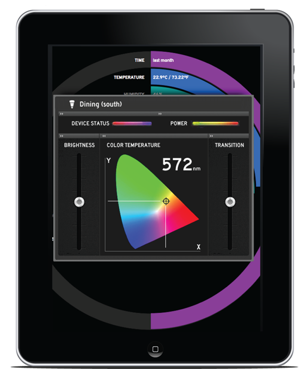

The Thing System Steward
=======

**To read this, you must be under Friend-DA from Carl. If you are not under Friend DA, you should not be reading this. This software is being actively developed and is nearly ready for release.**

The home has evolved from one computer in a back room to a network of computing devices all over the house. Many of these are user-facing devices, such as tablets, laptops, and desktops. However increasingly, the home network has a number of special-purpose devices—things—that turns the home network into a network not just for the user, but for their devices; a network of things.

The trouble with these things is that none of them talk to each other. They might be informing us, quantifying the world around us and allowing us to make better decisions, but it's still us that has to make the decisions, and the more things there are, the more decisions there are to make. The Internet of Things isn't connected together, not like the other Internet, the digital one. Right now its a series of—mostly proprietary—islands that don't talk to each other. We’re become a mechanical turk inside other people’s software.

The Thing System is a set of software components and network protocols that changes that. Our steward software is written in node.js making it both portable and easily extensible. It can run on your laptop, or fit onto a small single board computer like the Raspberry Pi.

Your first step is to go to the [the wiki](TheThingSystem/steward/wiki).

Enjoy!

###License

The steward software is released under the [MIT license](http://en.wikipedia.org/wiki/MIT_License).

Copyright (c) 2013 The Thing System, Inc.

Permission is hereby granted, free of charge, to any person obtaining a copy
of this software and associated documentation files (the "Software"), to deal
in the Software without restriction, including without limitation the rights
to use, copy, modify, merge, publish, distribute, sublicense, and/or sell
copies of the Software, and to permit persons to whom the Software is
furnished to do so, subject to the following conditions:

The above copyright notice and this permission notice shall be included in
all copies or substantial portions of the Software.

THE SOFTWARE IS PROVIDED "AS IS", WITHOUT WARRANTY OF ANY KIND, EXPRESS OR
IMPLIED, INCLUDING BUT NOT LIMITED TO THE WARRANTIES OF MERCHANTABILITY,
FITNESS FOR A PARTICULAR PURPOSE AND NONINFRINGEMENT. IN NO EVENT SHALL THE
AUTHORS OR COPYRIGHT HOLDERS BE LIABLE FOR ANY CLAIM, DAMAGES OR OTHER
LIABILITY, WHETHER IN AN ACTION OF CONTRACT, TORT OR OTHERWISE, ARISING FROM,
OUT OF OR IN CONNECTION WITH THE SOFTWARE OR THE USE OR OTHER DEALINGS IN
THE SOFTWARE.