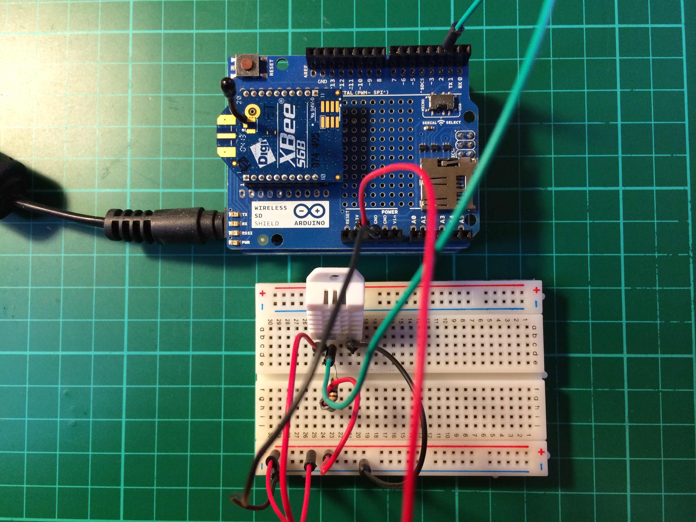
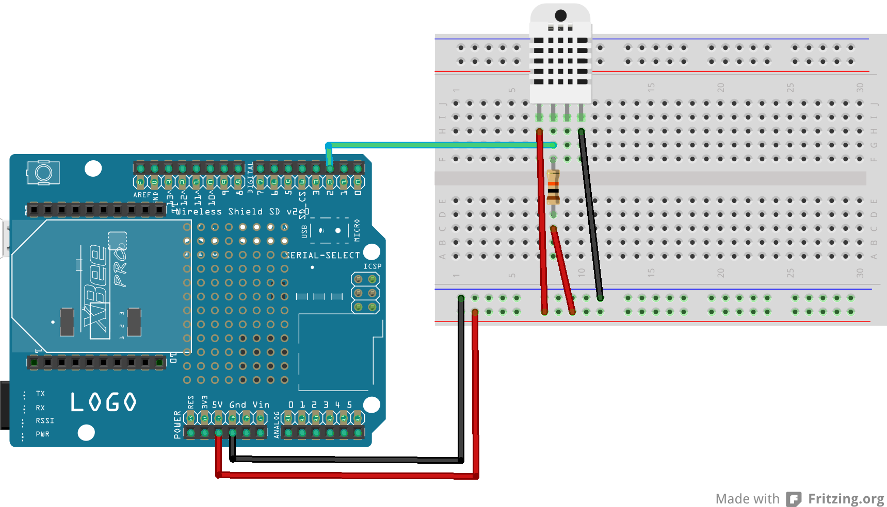
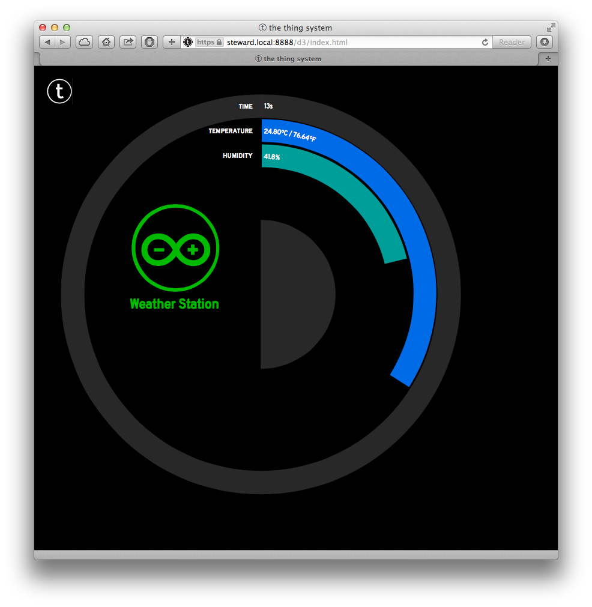

##README

The Digi XBee S6B Wi-Fi radio can make it really easy to build [TRSP](https://github.com/TheThingSystem/steward/wiki/Thing-Sensor-Reporting-Protocol) things as it can be easily configured to send multicast UDP packets by default in serial passthrough mode. The means that no complicated networking needs to be done in the Arduino sketch, instead you just need to write the TRSP JSON packet to the Serial port connected to the XBee.

###Download XCTU

The easiest way to configure your XBee radio is to use X-CTU. This is a firmware confguration utility available from Digi. Until recently this only ran on MS Windows, however a new version has recently been released [that supports both OS X and MS Windows](http://www.faludi.com/2013/09/22/new-xctu-for-mac-windows/).

Download X-CTU and install it on your laptop or desktop machine. When you run it you should get something that looks a lot like this,

###Configuring the Radio

Now go ahead and plug your XBee Wi-Fi radio into your laptop using an appropriate [adaptor board](http://www.adafruit.com/products/247).

Hit the "plus" button at the upper left of the X-CTU interface to bring up a list of Serial/USB ports. Select the correct port and hit "Finish." A popup window will appear as X-CTU looks for any radios connected to that port. Afterward you should get something that looks a lot like this,

Go ahead and click on the radio in the left-hand pane. This will trigger another popup while X-CTU reads the firmware values from the radio. These will appear in the right-hand pane, as below,

You should go ahead and reset the firmware configuration to the factory default by pushing the "Factory" button in the tab bar above the firmware values, and then the "Pencil" button to write the configuration back to the radio. A popup will appear while this occurs.

Scroll down to the _Network_ section of the configuration and set the ID, EE and PK lines to be the SSID, Encryption mode and Passphrase for your Wi-Fi network. These lines should turn green showing that they've been modified.

Click on the "Pencil" button again to write them to your radio, the lines should turn blue, showing that they've been modified to the radio, and written to the radio.

Scroll down to the _Addressing_ section of the configuration and set the DL, the destination address, to be the [TRSP](https://github.com/TheThingSystem/steward/wiki/Thing-Sensor-Reporting-Protocol) multicast address of 224.192.32.20.

You should also set the DE, the destination port, to the correct TRSP port. However you should note that the XBee wants you to enter the port numbe in hexidecimal. Since we want port 22601 we need to enter 5849 here for the destination port number. These lines should turn green, as before.

Click on the "Pencil" button again to write them to your radio, the lines should turn blue, showing that they've been modified to the radio, and written to the radio.

We have now finished configuring the XBee radio. You might want to go and check your home router to make sure it has successfully associated with your wireless network. The first time it does so, it might take a few moments to acquire a DHCP address.

You can now unplug your XBee Wi-Fi from the XBee adaptor connected to your laptop.

###Wiring the Breadboard

We're going to use an [Arduino Leonardo](http://arduino.cc/en/Main/arduinoBoardLeonardo) and the [Arduino Wireless SD Shield](http://arduino.cc/en/Main/ArduinoWirelessShield) along with a [DHT-22](http://www.adafruit.com/products/385) sensor to create a simple weather station measuring temperature and pressure which will report its readings via [TRSP](https://github.com/TheThingSystem/steward/wiki/Thing-Sensor-Reporting-Protocol) to the steward.

Plug the XBee Wi-Fi into the socket on the Wireless SD Shield and the shield into the Arduino Leonardo, then wire the breadboard and the DHT-22 sensor as shown above.

Open up the Arduino development environment and set the Board type and Serial port to the correct values and then upload the following [sketch](WeatherStationXBeeWiFi.ino) to the Arduino

    #include <DHT.h>
    #define DHTTYPE DHT22
    
    const int dhtPin = 2;
    DHT dht(dhtPin, DHTTYPE);
    
    int requestID = 1;
    
    char packetBuffer[512];
    char incomingBuffer[64];
    char mac[8];
    int bufferIndex = 0;
    
    PROGMEM prog_char *loopPacket1 = "{\"path\":\"/api/v1/thing/reporting\",\"requestID\":\"";
    PROGMEM prog_char *loopPacket2 = "\",\"things\":{\"/device/climate/arduino/sensor\":{\"prototype\":{\"device\":{\"name\":\"Arduino with DHT-22\",\"maker\":\"Arduino\"},\"name\":true,\"status\":[\"present\",\"absent\",\"recent\"],\"properties\":{\"temperature\":\"celsius\",\"humidity\":\"percentage\"}},\"instances\":[{\"name\":\"Weather Station\",\"status\":\"present\",\"unit\":{\"serial\":\"";
    PROGMEM prog_char *loopPacket3 = "\",\"udn\":\"195a42b0-ef6b-11e2-99d0-";
    PROGMEM prog_char *loopPacket4 = "-dnt-22\"},\"info\":{\"temperature\":";
    PROGMEM prog_char *loopPacket5 = ",\"humidity\":";
    PROGMEM prog_char *loopPacket6 = "},\"uptime\":";
    PROGMEM prog_char *loopPacket7 = "}]}}}";
    
    void setup() {
      Serial.begin(9600);
      Serial1.begin(9600);
      Serial.println("Starting...");
      while(!Serial) { }
    
      pinMode(dhtPin, INPUT);
      Serial.println("Initialising the DHT sensor.");
      dht.begin();
      
      Serial.println("Sending command string to XBee.");
      Serial1.print("+++");
      Serial.println("Waiting for response");
      delay(2000);
      while ( Serial1.available() ) {
        incomingBuffer[bufferIndex] = Serial1.read();
        bufferIndex++;
        if (strcmp(incomingBuffer, "OK") == 0){
           Serial.println("Got 'OK'");
           Serial.println("Sending ATSL command");
           Serial1.print("ATSL\r");
           delay(200);
           Serial.print("ID is '");
           for( int i = 0; i <= 9; i++ ) {
             incomingBuffer[i] = Serial1.read();
           }
           Serial.print(incomingBuffer);
           Serial.println("'");
           strncat(mac,incomingBuffer, 8);
           Serial.println("Sending ATCN command");
           Serial1.print("ATCN\r");
        }
      }
      Serial.println("Setup complete");
    }
    
    void loop() {
      float h = dht.readHumidity();
      float t = dht.readTemperature();
    
      if ( isnan(t) || isnan(h) ) {
        Serial.println("Error: Failed to read from DHT.");
      } else {
        requestID = requestID + 1;
    
        Serial.print( "t = " );
        Serial.print( t );
        Serial.print( "C, h = ");
        Serial.print( h );
        Serial.println( "%" );
    
        char buffer[12];
    
        strcpy(packetBuffer,(char*)pgm_read_word(&loopPacket1) );
        strcat(packetBuffer, itoa( requestID, buffer, 10) );
        strcat(packetBuffer,(char*)pgm_read_word(&loopPacket2) );
        for (byte thisByte = 1; thisByte < 9; thisByte++) {
          sprintf(buffer, "%c", incomingBuffer[thisByte] );
          strcat(packetBuffer, buffer); 
        }
        strcat(packetBuffer,(char*)pgm_read_word(&loopPacket3) );
        for (byte thisByte = 1; thisByte < 9; thisByte++) {
          sprintf(buffer, "%c", incomingBuffer[thisByte] );
          strcat(packetBuffer, buffer); 
        }  
        strcat(packetBuffer,(char*)pgm_read_word(&loopPacket4) );
        strcat(packetBuffer, dtostrf(t,4,2,buffer));
        strcat(packetBuffer,(char*)pgm_read_word(&loopPacket5) );
        strcat(packetBuffer, dtostrf(h,4,2,buffer));
        strcat(packetBuffer,(char*)pgm_read_word(&loopPacket6) );
        strcat(packetBuffer, itoa( millis(), buffer, 10) );
        strcat(packetBuffer,(char*)pgm_read_word(&loopPacket7) );
    
        Serial.println(packetBuffer); 
        Serial1.println(packetBuffer);
    
      }
      delay(2000);
    }	

This sketch will automatically find the serial number of the XBee Wi-Fi and use this as the unique identifier when talking to the steward.

###Running the Sketch

When the sketch runs, if you're watching the console log from the steward you should see something like this appear when the first TRSP packet is emitted,

    info: [discovery] Arduino with DHT-22 id=9D5E3009, udn=195a42b0-ef6b-11e2-99d0-9D5E3009-dnt-22, clientID=undefined, remoteAddress=192.168.1.107

which indicates that the steward has detected the new 'thing.'

If you go to [https://steward.local:8888](https://steward.local:8888) and look at the d3 client you should see your new Weather Station has appeared in your list of things.

and clicking on it you'll see the measurements for temperature and humidity from the DHT-22 sensor.

